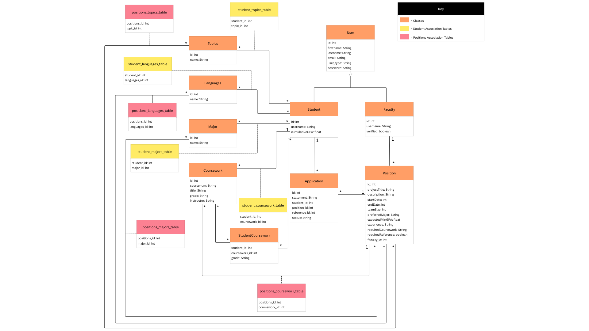

# Project Design Document

## Your Project Title
--------
Prepared by:

* `<McAlister Marshall>`,`<WPI>`
* `<Jake Claybrook>`,`<WPI>`
* `<Vanessa Villalba Simon>`,`<WPI>`
---

**Course** : CS 3733 - Software Engineering 

**Instructor**: Sakire Arslan Ay

---

## Table of Contents
- [1. Introduction](#1-introduction)
- [2. Software Design](#2-software-design)
    - [2.1 Database Model](#21-model)
    - [2.2 Modules and Interfaces](#22-modules-and-interfaces)
    - [2.2.1 Overview](#221-overview)
    - [2.2.2 Interfaces](#222-interfaces)
    - [2.3 User Interface Design](#23-view-and-user-interface-design)
- [3. References](#3-references)

### Document Revision History

| Name | Date | Changes | Version |
| ------ | ------ | --------- | --------- |
|Revision 1 |2025-11-14 |Initial draft | 1.0        |
|      |      |         |         |

# 1. Introduction

The purpose of this design document is to explain how our project will be structured and what the final application will look like once everything is built. We describe the main parts of the system, how the database will be organized, what routes we plan to use, and what the user interface will look like. Basically, this document helps us plan out the project so everyone on the team is on the same page before we start coding the full version.

# 2. Software Design

## 2.1 Database Model
1. User:
Stores basic information about all users in the system (both students and faculty). Contains login credentials, name, email, and a role field to distinguish faculty from students.

2. Faculty:
More specific user that stores information about the user, allows user to edit/add to Topics, Languages, Major and Coursework, post positions that a student can apply to and approve/reject applications.

3. Student:
More specific user that stores information about the user, allows user to view positions posted by a faculty user and apply to them.

5. Position:
Represents a research or project position created by a faculty member. Includes fields like title, description, required skills, status, and a foreign key linking it to the faculty member who created it.

6. Application:
Tracks applications submitted by students for specific positions. Links a student to a position and stores application details like submission date, status (pending/accepted/rejected), and any notes.

7. Topics:
Stores a list of research topics that can be viewed by users and edited/added by a faculty user.

8. Languages:
Stores a list of programming languages that can be viewed by users and edited/added by a faculty user.

9. Major:
Stores a list of majors that can be viewed by users and edited/added by a faculty user.

10. Coursework:
Stores a list of courses that can be viewed by users and edited/added by a faculty user.

11. StudentCoursework:
Stores a list of a student's courses and grades for those courses and can be edited by students to change the grade.

## 2.2 Modules and Interfaces

### 2.2.1 Overview

Client UI (Student/faculty pages)
Handles all user interaction. Renders the Student Page and Faculty Page , displays research positions , profiles , application statuses , and manages user inputs 

Application Logic (Backend)
Manages all core business rules and logic. Includes: User Management (login/SSO/authentication/account activation) , Profile Management (creating/editing profiles, pre-defined list management) , Position Management (creating, viewing, recommending) , Application Processing (submission, status updates, withdrawal) , and Recommendation Handling (notifications, approval/rejection)

Database
Persists all application data. Stores records for Students, Faculty (including the pre-loaded list) , Research Positions, Applications, Reference Requests, and the configurable predefined lists (majors, courses, research topics, etc.).

### 2.2.2 Interfaces

#### 2.2.2.1 \<User/Authentification> Routes

|   | Methods           | URL Path   | Description  |
|:--|:------------------|:-----------|:-------------|
|1. | GET                  |      /     |renders the applications main page|
|2. | GET, POST                  |      /login|              |renders the login form
|3. | GET                  | /logout    |logs the current user out              |
|4. | GET, POST                  |/student/register            |GET: Renders the student account creation form. POST: Creates a new student account and profile.              |
|5. | GET                  |  /faculty/activate          |Renders the page for Faculty to locate their pre-loaded profile              |
|6. | POST                  |/faculty/activate/verify            |Submits Faculty details to receive a confirmation email for verification              |
|7. | POST                  | /faculty/setup           |GET: Renders the final faculty account setup (username/password). POST: Completes the faculty account activation and profile creation.              |
#### 2.2.2.2 \<Student> Routes

|   | Methods           | URL Path   | Description  |
|:--|:------------------|:-----------|:-------------|
|1. |  GET                 |/student/dashboard            |renders the main student dashboard              |
|2. |  GET, POST                 |/student/profile            |views the student profile              |
|3. |  GET                 |/positions            |Displays a list of all open research positions              |
|4. |  GET                 |/positions/recommended            |displays the list of recommended research              |
|5. |  GET                 |/positions <int:position_id>            |Displays the full details of a specific research position              |
|6. |  GET, POST                 |/positions/<int:position_id>/apply            |GET: renders the application form. POST: submits an application for the specific position              |
|7. | POST                  |/applications/<int:application_id>/withdraw            |withdraws an application              |

#### 2.2.2.3 \<Faculty> Routes

|   | Methods           | URL Path   | Description  |
|:--|:------------------|:-----------|:-------------|
|1. | GET                  |/faculty/profile            |views the faculty profile              |
|2. | POST                  |/recommendation/<int:ref_id>/<string:status>            |Approves or rejects a specific recommendation request              |
|3. | GET, POST                  |/faculty/positions/create            |GET: renders the form to create a new position. POST: Creates and posts a new research position              |
|4. | GET                  |/faculty/positions            |Lists all research positions posted              |
|5. | GET                  |/faculty/positions/<int:position_id>/applicants            |Displays the list of students who applied for a specific position              |
|6. | GET                  |/faculty/applicants/<int:application_id>            |Views the full profile and qualifications of a specific student applicant              |
|7. | POST                  |/faculty/applications/approve            |Approves one or more student applications for a position              |
|8. | POST                  |/faculty/applications/reject            |Rejects one or more student applications              |

#### 2.2.2.4 \<Main> Routes

|     | Methods   | URL Path                                        | Description                                                      |
| :-- | :-------- | :---------------------------------------------- | :--------------------------------------------------------------- |
| 1.  | GET       | /`                                             | Load home page showing all research positions                    |
| 2.  | GET       | /home                                         | Same as `/`, loads home page with all positions                  |
| 3.  | GET, POST | /student/index                                | Student main index page listing positions and students           |
| 4.  | GET       | /student/profile                              | Display logged-in student's profile                              |
| 5.  | GET, POST | /student/editprofile                          | Edit student profile, majors, topics, coursework, languages      |
| 6.  | GET       | /faculty/application/view/<student_id>        | Faculty view of a specific student and their applications        |
| 7.  | GET       | /student/position/<int:id>/view               | Student view of a specific research position                     |
| 8.  | GET       | /student/dashboard                            | Dashboard showing all applications made by a student             |
| 9.  | GET, POST | /student/position/<position_id>/apply         | Apply to a research position (optionally with faculty reference) |
| 10. | GET, POST | /faculty/index                                | Faculty main index displaying their posted positions             |
| 11. | GET       | /faculty/profile                              | Display faculty profile, applicants per position, and statuses   |
| 12. | GET, POST | /faculty/position/post                        | Faculty creates a new research position                          |
| 13. | GET       | /faculty/lists                                | General faculty list management page                             |
| 14. | GET       | /faculty/majors                               | View list of all majors                                          |
| 15. | GET, POST | /faculty/majors/add                           | Add a new major                                                  |
| 16. | GET, POST | /faculty/majors/<major_id>/edit               | Edit an existing major                                           |
| 17. | GET       | /faculty/majors/<major_id>/delete             | Delete a major                                                   |
| 18. | GET       | /faculty/topics                               | View list of all topics                                          |
| 19. | GET, POST | /faculty/topics/add                           | Add a new topic                                                  |
| 20. | GET, POST | /faculty/topics/<topic_id>/edit               | Edit an existing topic                                           |
| 21. | GET       | /faculty/topics/<topic_id>/delete             | Delete a topic                                                   |
| 22. | GET       | /faculty/languages                            | View list of all programming languages                           |
| 23. | GET, POST | /faculty/languages/add                        | Add a new language                                               |
| 24. | GET, POST | /faculty/languages/<languages_id>/edit        | Edit an existing language                                        |
| 25. | GET       | /faculty/languages/<languages_id>/delete      | Delete a language                                                |
| 26. | GET       | /faculty/coursework                           | View list of coursework items                                    |
| 27. | GET, POST | /faculty/coursework/add                       | Add a new coursework item                                        |
| 28. | GET, POST | /faculty/coursework/<coursework_id>/edit      | Edit existing coursework                                         |
| 29. | GET       | /faculty/coursework/<coursework_id>/delete    | Delete a coursework entry                                        |
| 30. | POST      | /faculty/application/<application_id>/approve | Approve a student application for a position                     |
| 31. | POST      | /faculty/application/<application_id>/reject  | Reject a student application                                     |

### 2.3 User Interface Design 
 * Faculty main page

 * Student main page (show how you will display "all positions" vs "recommended positions")

 * Faculty creating a position 

 * Faculty accepting /rejecting an application

 * Student applying a position

# 3. References

